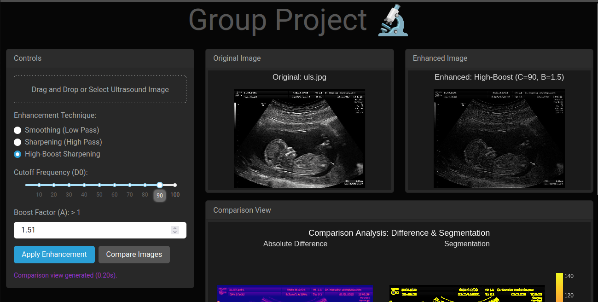
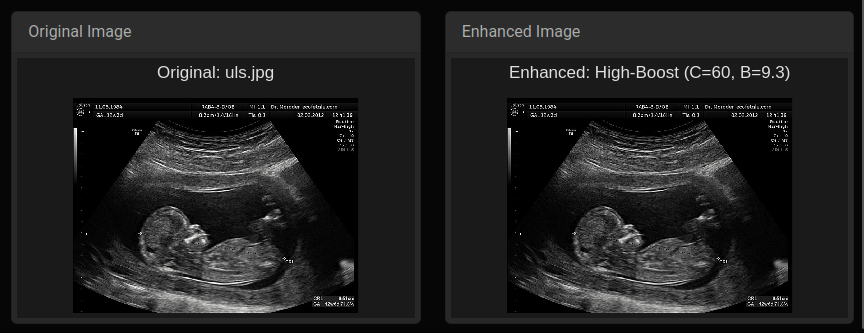
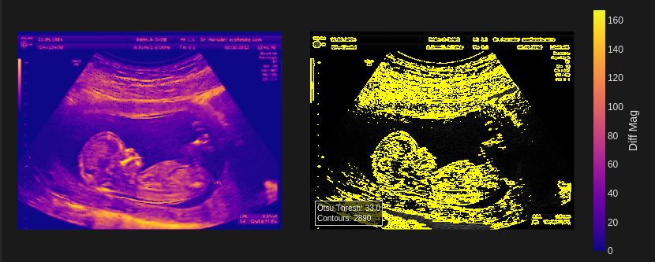

<!-- markdownlint-disable first-line-h1 -->
<!-- markdownlint-disable html -->
<!-- markdownlint-disable no-duplicate-header -->

<div align="center">
  <h1>Ultra-sound image enhancer</h1>
  <p>An Interactive Web Application for Ultrasound Image Enhancement & Comparison</p>
</div>
<hr>
<div align="center" style="line-height: 1;">
  <!-- Replace placeholders with your actual links -->
  <a href="https://github.com/LeoMcBills/ultrasound_image_enhancer"></a>
  <a href="https://github.com/LeoMcBills/ultrasound_image_enhancer/blob/main/LICENSE"></a>
  <!-- Add other relevant badges if desired (e.g., deployment link, documentation) -->

  <!-- Updated Live Demo Badge for Render -->
  <a href="https://ultrasound-image-enhancer.onrender.com"></a>
</div>

## Table of Contents

1.  [Introduction](#1-introduction)
2.  [Features](#2-features)
3.  [Demo](#3-demo)
4.  [Technologies Used](#4-technologies-used)
5.  [Installation](#5-installation)
6.  [Usage](#6-usage)
7.  [License](#7-license)
8.  [Contributing](#8-contributing)
9.  [Contact](#9-contact)

## 1. Introduction

This project provides an interactive web application built with Dash for enhancing and analyzing ultrasound images. Users can upload grayscale ultrasound images and apply various frequency-domain filtering techniques to improve image quality (smoothing, sharpening, high-boost). The application visualizes the original and enhanced images side-by-side and offers a comparison view featuring an absolute difference map and segmentation results (using Otsu's thresholding and contour detection) on the enhanced image.

The goal is to offer a user-friendly tool for researchers, students, or medical professionals to experiment with basic image enhancement techniques relevant to ultrasound imaging.

## 2. Features

*   **Image Upload:** Upload grayscale ultrasound images (PNG, JPG, BMP, etc.) via drag-and-drop or file selection.
*   **Enhancement Techniques:**
    *   **Smoothing (Gaussian Low Pass Filter):** Reduces noise by blurring the image in the frequency domain. Adjustable Cutoff Frequency (D0).
    *   **Sharpening (Gaussian High Pass Filter):** Enhances edges and details. Adjustable Cutoff Frequency (D0).
    *   **High-Boost Sharpening:** A variation of sharpening that retains more low-frequency components while sharpening. Adjustable Cutoff Frequency (D0) and Boost Factor (A).
*   **Interactive Controls:** Sliders and input fields allow real-time adjustment of filter parameters.
*   **Visualizations:**
    *   Displays the original uploaded image.
    *   Displays the enhanced image after applying the selected filter.
    *   Provides a dedicated comparison view:
        *   **Absolute Difference Map:** Visualizes the pixel-wise absolute difference between the original and enhanced images (using 'plasma' colormap).
        *   **Segmentation Overlay:** Shows the enhanced image with contours detected using Otsu's thresholding overlaid in yellow. Includes Otsu threshold value and contour count.
*   **Responsive Design:** The layout adapts to different screen sizes (desktops, tablets, mobile).
*   **Dark Theme:** Uses the `dash-bootstrap-components` CYBORG theme for a clean, dark interface.

## 3. Demo

**Main Interface:**

*(Caption: Overview of the application layout showing controls, original/enhanced image panes, and comparison view.)*

**Enhancement Example:**

*(Caption: Example showing an original ultrasound image and the result after applying High-Boost Sharpening.)*  

**Comparison View:**

*(Caption: Close-up of the Comparison View showing the Absolute Difference map and the Segmentation overlay.)*

## 4. Technologies Used

*   **Backend & Processing:**
    *   Python 3.x
    *   OpenCV (`opencv-python`): Core image processing (filtering, segmentation, encoding/decoding).
    *   NumPy: Numerical operations, array manipulation.
*   **Web Framework & Frontend:**
    *   Dash: Main framework for building the web application.
    *   Plotly: Creating interactive plots and image visualizations (`go.Heatmap`, `go.Image`).
    *   Dash Bootstrap Components (`dash-bootstrap-components`): Provides layout components (Cards, Rows, Cols) and Bootstrap styling (including the CYBORG theme).
*   **Deployment:**
    *   Render.com (Hosting Platform)
    *   Gunicorn (WSGI Server)

## 5. Installation

Follow these steps to set up the project locally:

1.  **Clone the Repository:**
    ```bash
    git clone https://github.com/LeoMcBills/ultrasound_image_enhancer.git
    cd ultrasound_image_enhancer
    ```

2.  **Create a Virtual Environment (Recommended):**
    ```bash
    # Linux/macOS
    python3 -m venv venv
    source venv/bin/activate

    # Windows
    python -m venv venv
    .\venv\Scripts\activate
    ```

3.  **Install Dependencies:**
    Make sure you have a `requirements.txt` file (you can generate one using `pip freeze > requirements.txt` in your development environment).
    ```bash
    pip install -r requirements.txt
    ```
    *(If you don't have a `requirements.txt`, install manually):*
    ```bash
    pip install dash dash-bootstrap-components opencv-python numpy matplotlib plotly gunicorn
    ```

## 6. Usage

1.  **Run Locally:**
    Navigate to the project directory in your terminal (ensure your virtual environment is activated).
    ```bash
    python app.py
    ```
    Access the app in your browser at `http://127.0.0.1:8050`.

2.  **Run for Production (using Gunicorn, similar to Render):**
    ```bash
    gunicorn -w 4 -b 0.0.0.0:8050 app:server
    ```
    Access the app at `http://<your-local-ip>:8050`.

3.  **Deployed App:**
    Visit the live application hosted on Render: [https://ultrasound-image-enhancer.onrender.com/](https://ultrasound-image-enhancer.onrender.com)

4.  **Workflow:**
    *   Use the "Drag and Drop or Select Ultrasound Image" area to upload a grayscale image.
    *   The original image will appear in the top-left pane.
    *   Select an "Enhancement Technique" (Smoothing, Sharpening, High-Boost).
    *   Adjust the filter parameters (Cutoff Frequency, Boost Factor if applicable) using the sliders/inputs that appear.
    *   Click the "Apply Enhancement" button. The enhanced image will appear in the top-right pane.
    *   Once an enhancement is applied, the "Compare Images" button will be enabled. Click it to generate the Difference Map and Segmentation Overlay in the bottom pane.
    *   Status messages will appear below the controls to indicate progress or errors.

## 7. License

This project is licensed under the MIT License. See the [LICENSE](LICENSE) file for details.

## 8. Contributing

Contributions are welcome! If you'd like to contribute, please follow these steps:

1.  Fork the repository.
2.  Create a new branch (`git checkout -b feature/your-feature-name`).
3.  Make your changes.
4.  Commit your changes (`git commit -m 'Add some feature'`).
5.  Push to the branch (`git push origin feature/your-feature-name`).
6.  Open a Pull Request.

Please ensure your code adheres to basic Python best practices and includes comments where necessary.

## 9. Contact

If you have any questions, suggestions, or issues, please feel free to open an issue on the GitHub repository:

[https://github.com/LeoMcBills/ultrasound_image_enhancer/issues](https://github.com/LeoMcBills/ultrasound_image_enhancer/issues)

Or contact the author:
*   GitHub: [tr8cycl](https://github.com/tr8cycl)
*   Email: natukundatracy11740@gmail.com
*   
*   GitHub: [LeoMcBills](https://github.com/LeoMcBills)
*   Email: leokinyera81@gmail.com
